# Agenda telefônica

- [Como usar com docker?](#como-usar-com-docker)
    - [Como usar com docker?](#como-usar-com-docker)
    - [Executar os testes do backend e cobertura de código](#executar-os-testes-do-backend-e-cobertura-de-código)
    - [Executar em produção](#executar-em-produção)
    - [Executar em desenvolvimento](#executar-em-desenvolvimento)
- [Screenshots v2](#screenshots-v2)
- [Screenshots v1](#screenshots-v1)

## Ferramentas usadas

| Nome | Versão |
| :-: | :-: |
| Docker | 27.3.1, build ce12230 |
| Docker Compose | v2.29.7 |
| Localstack | 3.1.10 |
| MySQL | 8.0 |
| Act (GH Actions) | v0.2.61 |
| Nodejs | 22.11.0 |
| Reactjs | 18.13.1 |
| Typescript | 5.6.2 |
| Vite | 5.4.10 |

## Como usar com docker?

- `make init-all`: inicia os containers e terraform

**OU**

- `make up`: inicia todos os containers
- `make terraform-apply-local`

### Executar os testes do backend e cobertura de código

- `make backend-test`

### Executar em produção

- `make backend-start`
- `make frontend-express`

### Executar em desenvolvimento

- Abre o vscode na pasta da aplicação
- Abrir o vscode no docker: `ctrl+shift+p` > `"Dev Containers: Rebuild and Reopen in Container"` > `enter`

## Screenshots v2

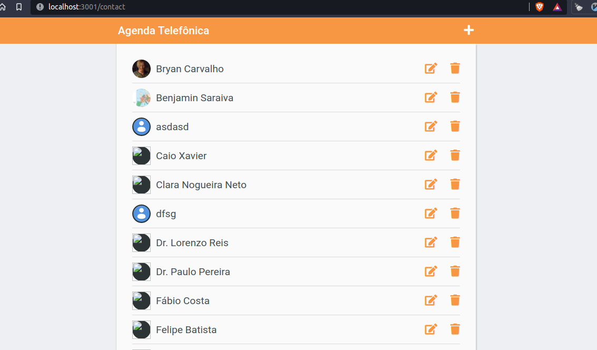
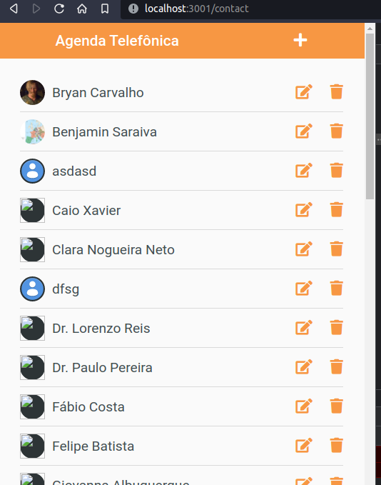
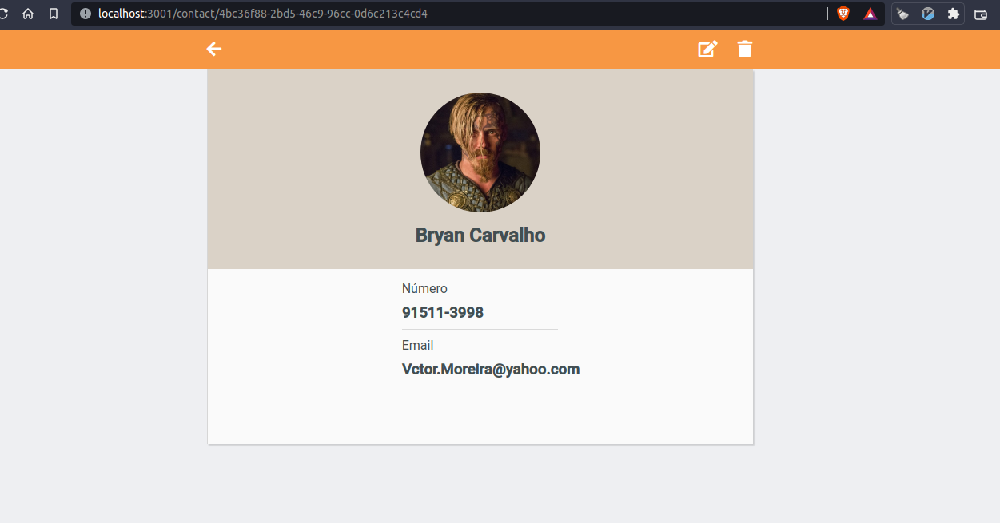
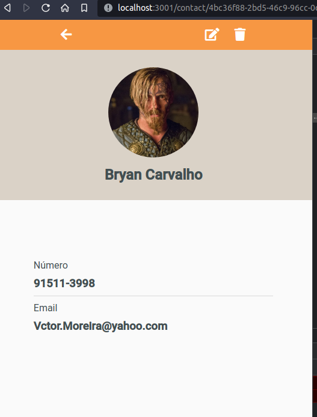
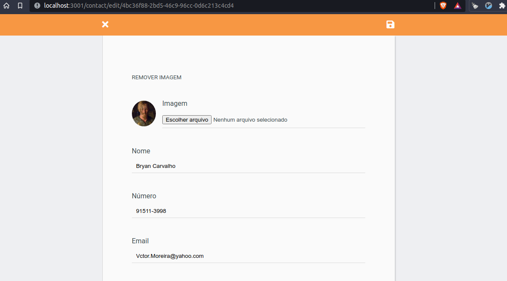
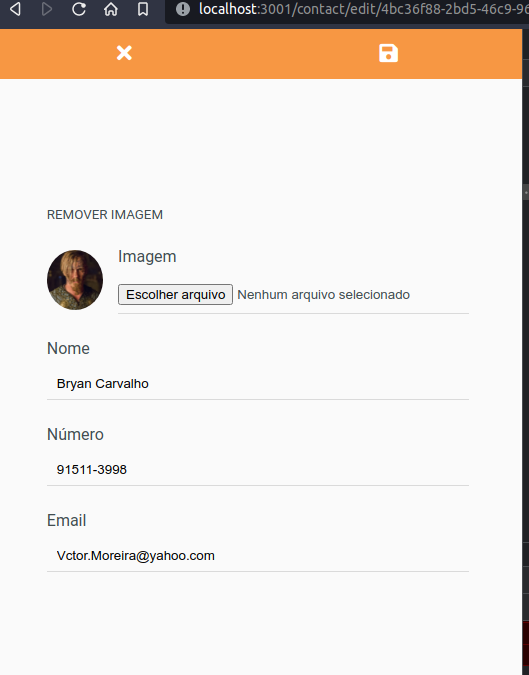
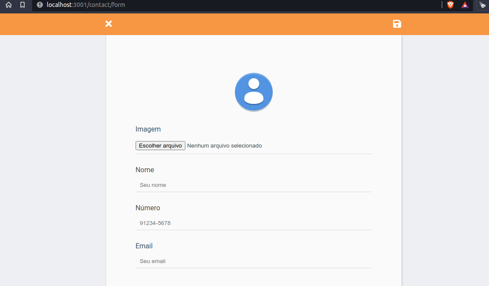
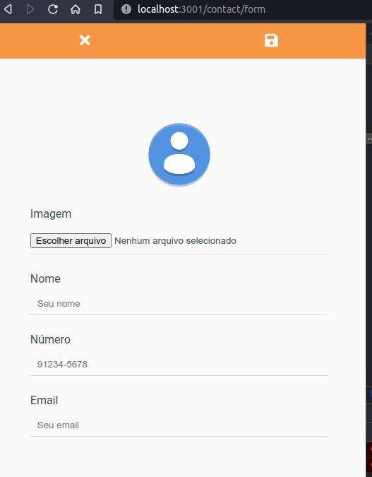

## Screenshots v1

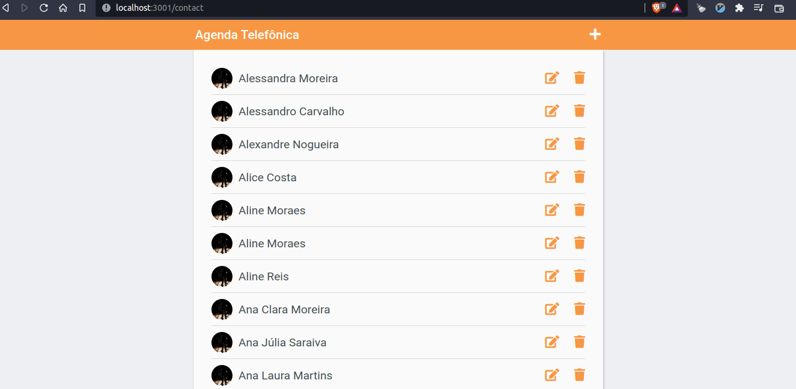
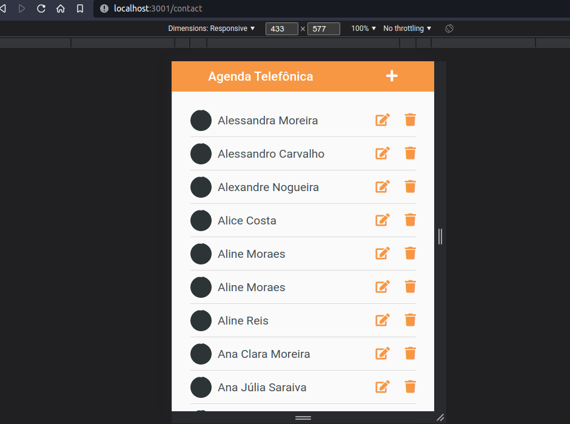
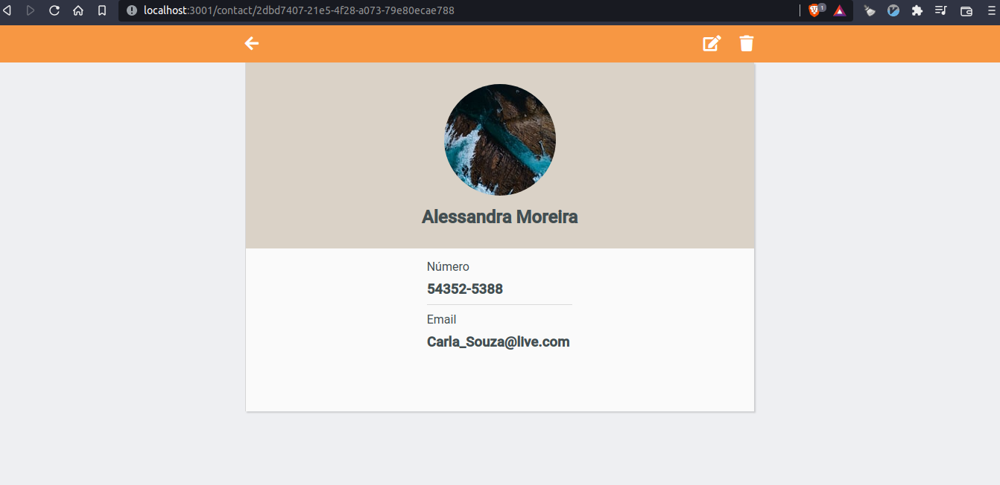
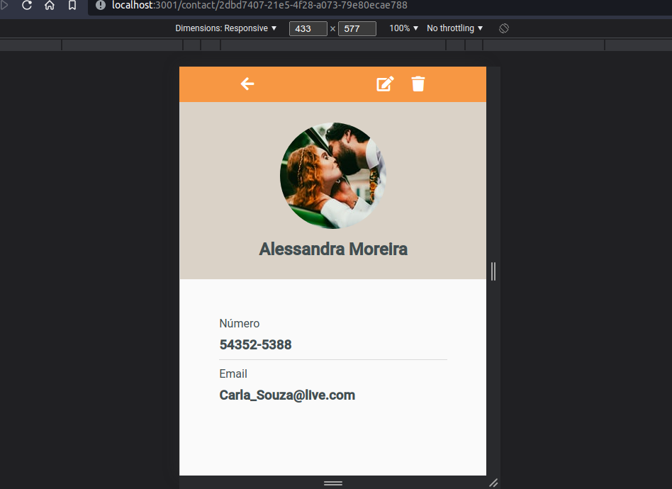
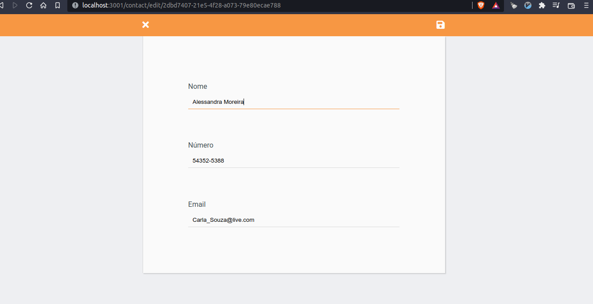
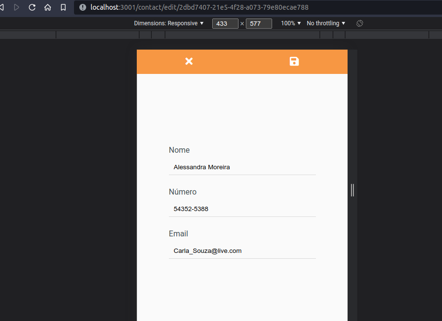
