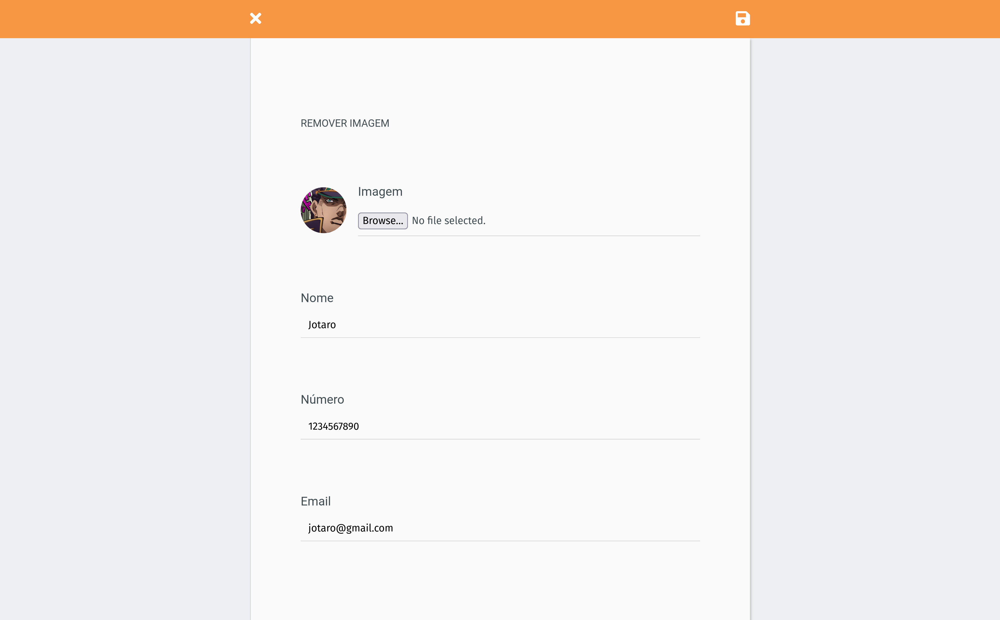

# Agenda telefônica

- [Screenshots](#screenshots)
- [Como usar com docker?](#como-usar-com-docker)

## Screenshots

## Como usar com docker?

1. `sh run-app.sh`

**OU**

1. `docker volume create --name=v_mysql`
1. `docker-compose up -d`
1. `docker-compose exec mysql mysql -uroot --password=root -e "create database if not exists agenda; create database if not exists agenda_test;"`
1. `docker-compose exec agenda-backend npx sequelize db:migrate`
1. `docker-compose exec agenda-backend npx sequelize db:seed:all`
1. `docker-compose exec -d agenda-backend npm start`
1. `docker-compose exec -d agenda-frontend npm start`

**CASO QUEIRA EXECUTAR OS TESTES**

1. `docker-compose exec agenda-backend npm test`
