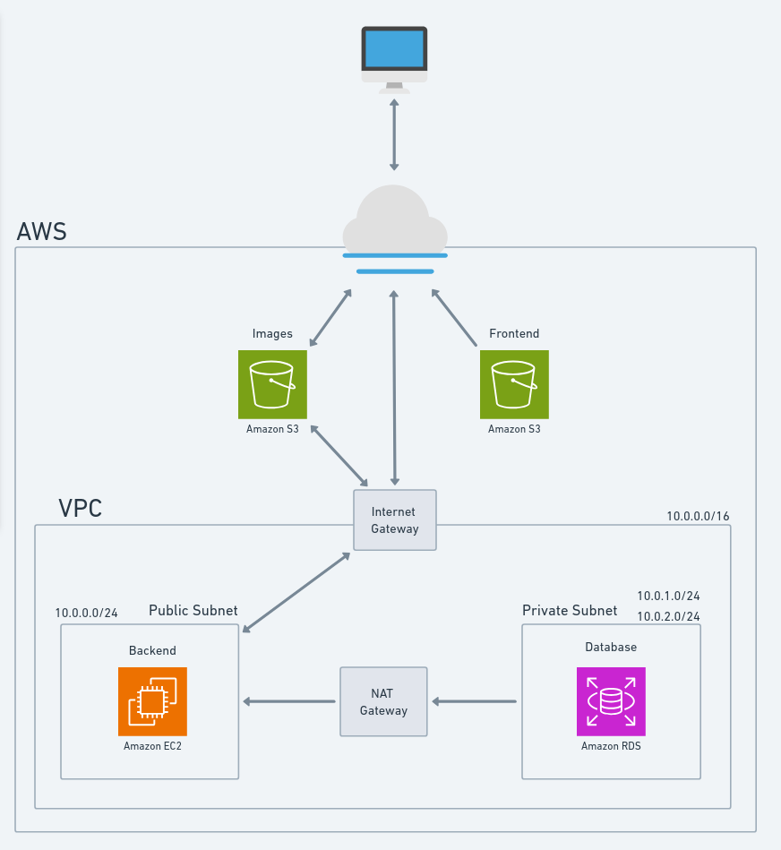
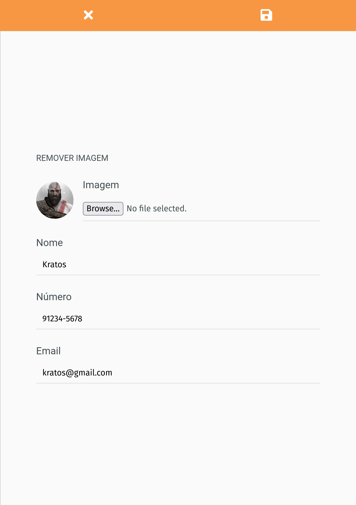

# Agenda telefônica

Esse projeto foi um teste técnico feito em 3 dias com React, Nodejs, Express e MySQL. Posteriormente foi atualizado para fazer deploy na AWS S3 e usar seus serviços como AWS S3, AWS EC2 e AWS RDS, tudo provisionado com o Terraform. 

Outras mudanças foram:

- a atualização de todas as libs
- o uso do Docker
- uso do Typescript no React
- uso do useReducer no React
- CI/CD com GitHub Actions e testar localmente com Act

## Sumário

- [Ferramentas usadas](#ferramentas-usadas)
- [Arquitetura do Sistema na AWS](#arquitetura-do-sistema-na-aws)
- [Como executar com docker?](#como-executar-com-docker)
    - [Executar os testes do backend e cobertura de código](#executar-os-testes-do-backend-e-cobertura-de-código)
    - [Executar em desenvolvimento](#executar-em-desenvolvimento)
- [Testar o CI/CD local com Act](#testar-o-cicd-local-com-act)
- [Testar os scripts para o backend sempre rodar no vagrant](#testar-os-scripts-para-o-backend-sempre-rodar-no-vagrant)
- [Deploy na AWS](#deploy-na-aws)
- [Screenshots](#screenshots)

## Ferramentas usadas

| Nome | Versão |
| :-: | :-: |
| Docker | 27.3.1, build ce12230 |
| Docker Compose | v2.29.7 |
| Localstack | 3.1.10 |
| MySQL | 8.0 |
| Act (GH Actions) | v0.2.61 |
| Nodejs | 22.11.0 |
| Reactjs | 18.13.1 |
| Typescript | 5.6.2 |
| Vite | 5.4.10 |

## Arquitetura do Sistema na AWS

    

## Como executar com docker?

- `make init-all`: inicia os containers e terraform
- As urls para acessar os serviços do docker são:
    - Frontend: `http://localhost:3001/`
    - Backend: `http://localhost:3000/`
    - Bucket agenda-images: `http://localhost:4566/agenda-images`
    - PhpMyAdmin: `http://localhost:8081/`
- Finalize os containeres `make down`
- Delete os recursos no Localstack: `make terraform-destroy-local`

### Executar os testes do backend e cobertura de código

- `make backend-test`

### Testar o build do frontend localmente

- `make frontend-express`

### Executar em desenvolvimento

- Abre o vscode na pasta da aplicação
- Abrir o vscode no docker: `ctrl+shift+p` > `"Dev Containers: Rebuild and Reopen in Container"` > `enter`

## Testar o CI/CD local com Act

- `make ci-cd`

## Testar os scripts para o backend sempre rodar no vagrant

> Não vai funcionar, pois o banco de dados não está configurado, mas pode ser testado o funcionamento do systemd. Se deletar ou parar o container, o script irá executar para deixar o container de 'novamente.

- Crie a máquina virtual (VM): `vagrant up`
- Copie o path absoluto do pivate key `vagrant ssh-config | grep IdentityFile`
- Substitua o <FILE_PATH> pelo que foi copiado e execute: `rsync -vahz -e 'ssh -i <FILE_PATH> -p 2222' ./aws-scripts vagrant@127.0.0.1:/home/ubuntu/`
- Execute `ssh -p 2222 -i <FILE_PATH> vagrant@127.0.0.1 bash /home/ubuntu/aws-scripts/init-all.sh` para configurar o backend na VM
- Acesse a VM `vagrant ssh`
    - `cd /home/ubuntu/aws-scripts`
    - Veja o status do service criado `systemctl status agenda-backend`
    - Veja os logs do service agenda-backend `sudo journalctl -u agenda-backend`
    - Liste os containeres `make ls`
    - Caso o container tenha sido criado, remova ele `make rm`
    - Liste de novo `make ls`, ele deve ser criado automaticamente pelo script do systemd
- Destrua a VM: `vagrant destroy`

## Deploy na AWS

- Gere a chave SSH para o EC2
    - `ssh-keygen -t rsa -b 2048 -f ./agenda_ec2_key -N ""`
    - `chmod 400 ./agenda_ec2_key`
- `make terraform-init`
- `make terraform-plan`
- `make terraform-apply`
    - Espere uns 5 segundos e execute novamente o comando de novo para exibir o IP do EC2 no output
- Copie output que o terraform irá exibir para trocar as variáveis de ambiente do backend e do frontend:
    - Copie o `ec2_public_ip` e cole na variável `prodBackendUrl` que está no arquivo `./frontend/src/env.ts`.
    - Duplique o env file com `cp ./aws-scripts/agenda-backend/.env.backend.example ./aws-scripts/agenda-backend/.env.backend`.
    - Copie o `rds_address` e `s3_frontend_endpoint` e substitua os valores `DB_HOST_PROD` e `FRONTEND_URL` no `.env.backend`.
- Gere o build do frontend do frontend com as variáveis de ambiente já setadas do IP do EC2.
    - `make frontend-pull-and-build`
- Execute novamente o `make terraform-apply` para fazer upload do build gerado do frontend.
- Deploy do backend
    - Substitua o `<PUBLIC-IP>` dos comandos abaixo pelo IP do EC2.
    - Faça upload do diretório aws-scripts para o EC2 via rsync com ssh `rsync -vahz -e 'ssh -i ./agenda_ec2_key -p 22' ./aws-scripts ubuntu@<PUBLIC-IP>:/home/ubuntu`
    - Execute o script `init-all.sh` que está no EC2 `ssh -i ./agenda_ec2_key ubuntu@<PUBLIC-IP> bash /home/ubuntu/aws-scripts/init-all.sh`
- Limpar os recursos criados na AWS
    - Delete todos os objetos que existem o bucket `agenda-images` pela GUI ou pela CLI `aws s3 rm --recursive s3://agenda-images`
    - Delete todos os recursos criados com `make terraform-destroy`

## Screenshots

    
    
    
    
    
    

